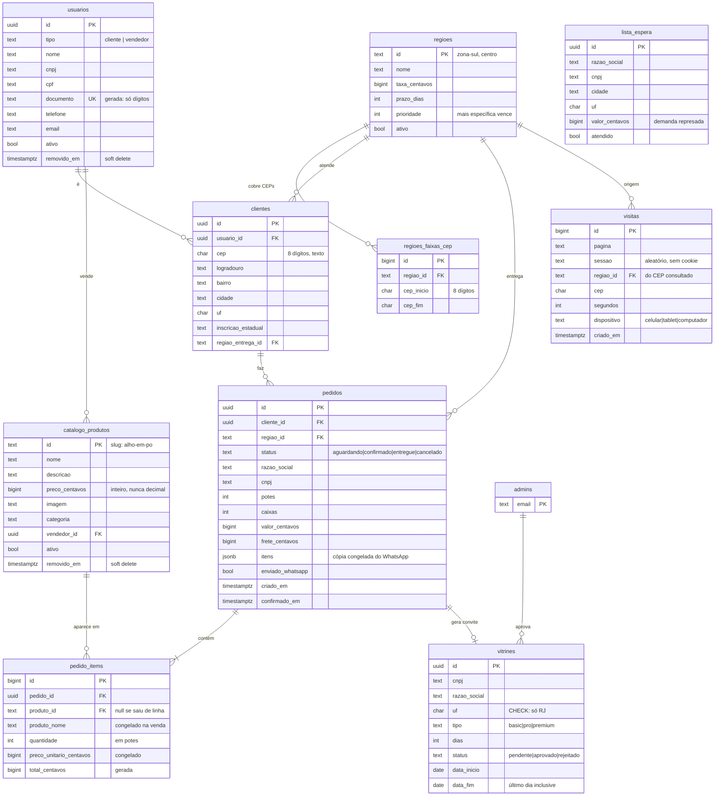

# Estrutura do banco

Onze tabelas, um esquema (`public`), Postgres no Supabase. Este documento é o
mapa; o que cria cada coisa está em [`admin/migracoes/LEIAME.md`](migracoes/LEIAME.md).

## Diagrama

## De onde veio cada tabela

A especificação pedia oito tabelas. Sete já existiam ou tinham equivalente — o
que foi feito foi ligar, não recriar.

| Pedido na especificação | No banco | Situação |
|---|---|---|
| `usuarios` | `usuarios` | criada na 004 |
| `clientes` | `clientes` | criada na 004 |
| `catalogo_produtos` | `catalogo_produtos` | criada na 005, semeada com os 73 |
| `pedidos` | `pedidos` | **já existia**; ganhou `cliente_id`, `regiao_id`, `enviado_whatsapp` |
| `pedido_items` | `pedido_items` | criada na 006 |
| `regioes_entrega` | `regioes` + `regioes_faixas_cep` | **já existia** |
| `displays` | `vitrines` | **já existia** |
| `visitas_site` | `visitas` | **já existia**; ganhou região, dispositivo e duração |

Duas tabelas que a especificação não listava e que já sustentam o sistema:
`admins` (quem pode entrar no painel) e `lista_espera` (quem ficou de fora da
área de entrega).

## Cinco decisões que valem saber

**Dinheiro é `bigint` de centavos, nunca decimal.** Todo o sistema já é assim.
Ponto flutuante em dinheiro acumula erro: some um centavo por linha e o total
do pedido para de bater com a soma dos itens.

**CEP é `char(8)` de texto, nunca número.** Como número, `20000-000` perde o
zero da frente — e metade do Rio começa com 2.

**A chave do cliente é o CNPJ, porque já era.** O painel e a função
`historico_do_cliente()` já agrupam por CNPJ ignorando pontuação. A coluna
gerada `documento` normaliza para dígitos puros e carrega a unicidade.

**`historico_pedidos` não é uma coluna json.** Seria uma segunda cópia da
tabela de pedidos dentro da linha do cliente, e no dia em que um pedido mudasse
de status as duas discordariam. É a relação `clientes 1:N pedidos`, resumida na
view `clientes_historico`.

**`pedidos.itens` (jsonb) e `pedido_items` não são a mesma informação duas
vezes.** O jsonb é a cópia congelada do que foi para o WhatsApp — prova, nunca
editada, nunca somada. `pedido_items` é a verdade consultável: todo relatório
por produto sai dela. Se divergirem, `pedido_items` está certa, porque é
derivada da outra.

## Operações

| O quê | Como | Quem pode |
|---|---|---|
| Criar pedido | `INSERT` em `pedidos` (como hoje) ou `criar_pedido(jsonb)` | qualquer visitante |
| Marcar enviado no WhatsApp | `marcar_enviado_whatsapp(id)` | qualquer visitante (só liga, nunca desliga) |
| Mudar status do pedido | `atualizar_status_pedido(id, status, obs)` | admin |
| Criar/editar produto | `salvar_produto(...)` | admin |
| Remover produto | `remover_produto(id)` — soft delete | admin |
| Restaurar produto | `restaurar_produto(id)` | admin |
| Aprovar vitrine | `decidir_vitrine(id, aprovar, obs)` | admin |
| Vendas por produto | `vendas_por_produto(meses)` | admin |
| Visitas por região | `visitas_por_regiao(meses)` | admin |
| Faturamento mensal | `resumo_mensal(meses)` | admin |

## Índices

Os que a especificação pediu, mais os que as chaves estrangeiras exigem para o
`join` não varrer a tabela inteira.

| Tabela | Índice | Para quê |
|---|---|---|
| `pedidos` | `criado_em desc` | listar e filtrar por data |
| `pedidos` | `cliente_id` | histórico de um cliente |
| `pedidos` | `status`, `confirmado_em desc` | fila e faturamento |
| `pedidos` | `regiao_id` | relatório por região |
| `catalogo_produtos` | `vendedor_id` | produtos de um vendedor |
| `catalogo_produtos` | `nome` (parcial: só ativos) | catálogo |
| `pedido_items` | `pedido_id`, `produto_id` | montar o pedido, vendas por produto |
| `clientes` | `cep` | busca por CEP |
| `clientes` | `usuario_id`, `regiao_entrega_id` | joins |
| `visitas` | `criado_em desc` | relatório mensal |
| `visitas` | `regiao_id`, `dispositivo`, `sessao` | relatório por região e por aparelho |
| `usuarios` | `documento` (único, só entre os vivos) | achar cliente pelo CNPJ |
| `regioes_faixas_cep` | `(cep_inicio, cep_fim)` | resolver o CEP em região |

## Segurança

A chave que o site usa (`anon`) é pública: vai no código da página e qualquer
visitante consegue lê-la. Quem protege os dados é o Row Level Security.

| Tabela | Visitante anônimo | Admin |
|---|---|---|
| `pedidos` | só inserir | ler e atualizar |
| `visitas` | inserir e completar a própria (6h) | ler |
| `lista_espera` | só inserir | ler e atualizar |
| `vitrines` | só inserir (pendente, RJ) | tudo |
| `usuarios`, `clientes`, `pedido_items` | **nada** | tudo |
| `catalogo_produtos` | ler só os ativos | tudo |
| `regioes`, `regioes_faixas_cep` | ler | escrever |

As tabelas de cadastro não têm política nenhuma para visitante. Quem escreve
nelas são os gatilhos da migração 006, que rodam como `security definer` a
partir do pedido — assim o site continua só inserindo pedido, sem ganhar uma
porta nova para escrever no cadastro.

**O que continua sendo possível para quem editar a página no navegador:**
inserir um pedido falso, ou marcar como enviado um pedido que não foi. É o
preço de um site estático sem servidor — para o site poder gravar, a permissão
de gravar tem que ser pública. Um pedido falso aparece na hora na aba Pedidos e
você cancela. Se um dia virar problema, o caminho é um servidor próprio
intermediando a gravação.

**O que não é possível:** ler pedido, cliente, contato ou qualquer dado pessoal
de alguém. E, desde a 006, também não é possível alterar o cadastro de um
cliente enviando um pedido com o CNPJ dele — os gatilhos só preenchem campo
vazio, nunca sobrescrevem.
